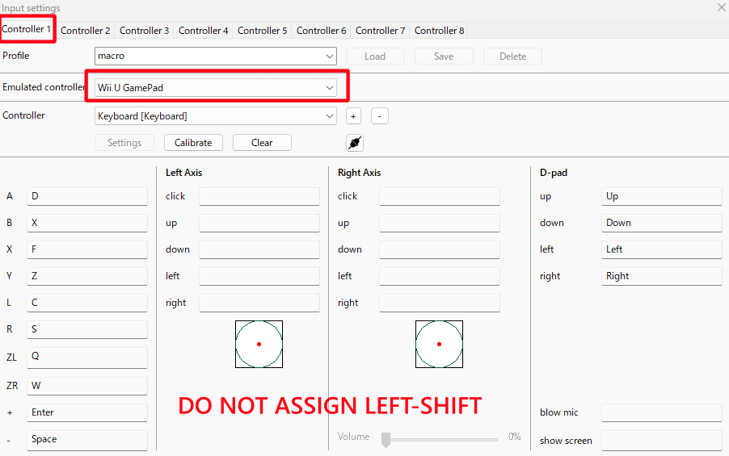
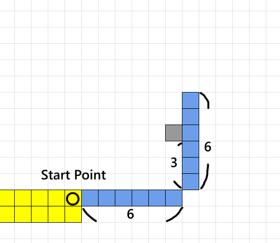
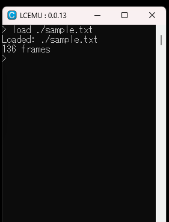
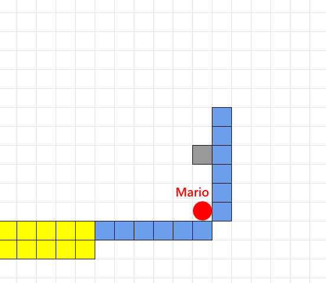
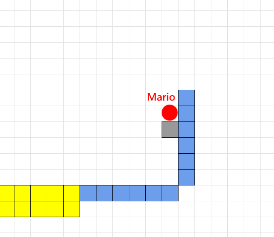

# Quick Start
## 1. インストール
GitHubのLCEMUの[公式レポジトリ](https://github.com/UnknownLTAS/LCEMU/releases)から最新のリリースをダウンロードしてください。設定や使い方のほとんどは[Cemu](https://github.com/cemu-project/Cemu)と一緒です。

注1: 入力設定は下記2. を参照してください。

注2: LCEMUはMacとLinuxをサポートしません。


## 2. Input Settings
以下の制約を守ってください。
- WiiU GamePadをController1に設定する。
- LEFT-SHIFTを割り当てない



## 3. Tutorial (SMM1)
以下のCUIウィンドウでマクロツールを操作します。このウィンドウを閉じると、アプリが終了するので気をつけてください。不要な場合は最小化してください。また、Ctrl+Cを押すと壊れるというバグがあるので押さないでください。


### 最初のマクロ 
注: SMM1のキー設定は、"Y"でダッシュ、"B"でジャンプするようにしてください。

[1] 以下のようなコースを作ります。
- 青の四角は通り抜け不可能なブロックにしてください(地面ブロックなど)
- グレーの四角は雲ブロックかちくわブロックにしてください。



[2] sample.txtを{LCEMU_PATH}/macro直下に作ってください。以下のようなファイル構造になります。

```
LCEMU
-- LCEMU.exe
-- macro 
   -- sample.txt
```
[3]  以下の内容をsample.txtに書き込んで保存してください。
```
M
N*95
// start
Y>*40
```
- `M` = "-"を押す。
- `N*95` = 95フレームの間何も押さない。
- `// start` = これはコメントです。無視されます。
- `Y>*40` = "Y"、"Right"を40 frameの間押す。

これらの詳しい説明は[ドキュメント](./document_ja.md#ボタンを表す文字一覧)にあります。

[4] `load ./sample.txt`とCUIに入力してください。"Loaded: ./sample.txt"と表示されたら成功です。



[5] 同様に`start`と入力すると"Started"と表示され、マクロが開始されます。

注: つくるモードの状態で入力してください。

6つのブロックの一番右までマリオが走り、最終的には以下のようになります。



[6] 結果を確認したら、手動でつくるモードに戻ってください。

[7] sample.txtを以下のように書き換えて保存してください。

```
M
N*95
// start
Y>*40
YB>*20
```
- `YB>*20` = "Y","B", "Right"を20フレームの間押す

[8] CUIに`reload`と入力してください。リロードされて、新しく書き込んだ内容が反映されます。

[9] CUIに`start`と入力してください。マクロが開始されます。

先ほどのマクロと同じ動きをした後に、マリオがジャンプします。最終的には、以下のようになります。



このように、書き換え -> `reload` -> `start`を繰り返していきます。

詳しい機能の説明は[ドキュメント](./document_ja.md)にあります。

## 4. Tips

- このツールには、ゲームのロード処理でランダムにdesyncするという問題があります。
- LEFT-SHIFTでFrame Advanceが使えます。
- マクロには入力情報以外に特殊な命令を入れることができます。

SMM1のTipsは[こちら](./smm1_tips_ja.md)。